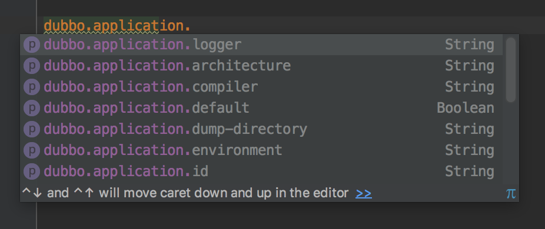

# Dubbo Spring Boot Project

[Dubbo](https://github.com/alibaba/dubbo) Spring Boot Project makes it easy to create [Spring Boot](https://github.com/spring-projects/spring-boot/) application using Dubbo as RPC Framework. What's more , it aslo provides production-ready features (e.g.security, health checks, externalized configuration).


> Dubbo *|ˈdʌbəʊ|* is a high-performance, java based [RPC](https://en.wikipedia.org/wiki/Remote_procedure_call) framework open-sourced by Alibaba. As in many RPC systems, dubbo is based around the idea of defining a service, specifying the methods that can be called remotely with their parameters and return types. On the server side, the server implements this interface and runs a dubbo server to handle client calls. On the client side, the client has a stub that provides the same methods as the server.


## Getting Started

If you don't know about Dubbo , please take a few minutes to learn http://dubbo.io/ . After that  you could dive deep into dubbo [user guide](http://dubbo.io/books/dubbo-user-book-en/).

Usually , There are two usage scenarios for Dubbo applications , one is Dubbo service(s) provider , another is Dubbo service(s) consumer, thus let's get a quick start on them.

First of all , we suppose an interface as Dubbo PRC API that  a service provider exports and a service client consumes : 

```java
public interface DemoService {

    String sayHello(String name);

}
```


### Dubbo service(s) provider

Service Provider implements `DemoService` :

```java
        version = "1.0.0",
        application = "${dubbo.application.id}",
        protocol = "${dubbo.protocol.id}",
        registry = "${dubbo.registry.id}"
)
public class DefaultDemoService implements DemoService {

    public String sayHello(String name) {
        return "Hello, " + name + " (from Spring Boot)";
    }

}
```


then , provides a bootstrap class : 

```java
@SpringBootApplication
public class DubboProviderDemo {

    public static void main(String[] args) {

        SpringApplication.run(DubboProviderDemo.class,args);

    }

}
```


last , configures `application.properties` :

```proper
# Spring boot application
spring.application.name = dubbo-provider-demo
server.port = 9090
management.port = 9091

# Base packages to scan Dubbo Components (e.g @Service , @Reference)
dubbo.scan.basePackages  = com.alibaba.boot.dubbo.demo.provider.service

# Dubbo Config properties
## ApplicationConfig Bean
dubbo.application.id = dubbo-provider-demo
dubbo.application.name = dubbo-provider-demo

## ProtocolConfig Bean
dubbo.protocol.id = dubbo
dubbo.protocol.name = dubbo
dubbo.protocol.port = 12345

## RegistryConfig Bean
dubbo.registry.id = my-registry
dubbo.registry.address = N/A
```


`DefaultDemoService`'s placeholders( `${dubbo.application.id}`, `${dubbo.protocol.id}`, `${dubbo.registry.id}` ) sources from `application.properties`.


More details , please refer to [Dubbo Provider Sample](dubbo-spring-boot-samples/dubbo-spring-boot-sample-provider).


### Dubbo service(s) consumer


Service consumer requires Spring Beans to reference `DemoService` :

```java
@RestController
public class DemoConsumerController {

    @Reference(version = "1.0.0",
            application = "${dubbo.application.id}",
            url = "dubbo://localhost:12345")
    private DemoService demoService;

    @RequestMapping("/sayHello")
    public String sayHello(@RequestParam String name) {
        return demoService.sayHello(name);
    }

}
```


then , also provide a bootstrap class :

```java
@SpringBootApplication(scanBasePackages = "com.alibaba.boot.dubbo.demo.consumer.controller")
public class DubboConsumerDemo {

    public static void main(String[] args) {

        SpringApplication.run(DubboConsumerDemo.class,args);

    }

}
```


last , configures `application.properties` :

```properties
# Spring boot application
spring.application.name = dubbo-consumer-demo
server.port = 8080
management.port = 8081


# Dubbo Config properties
## ApplicationConfig Bean
dubbo.application.id = dubbo-consumer-demo
dubbo.application.name = dubbo-consumer-demo

## ProtocolConfig Bean
dubbo.protocol.id = dubbo
dubbo.protocol.name = dubbo
dubbo.protocol.port = 12345
```


If `DubboProviderDemo` works well , please mark sure Dubbo service(s) is active.


More details , please refer to [Dubbo Consumer Sample](dubbo-spring-boot-samples/dubbo-spring-boot-sample-consumer)


## Getting help

Having trouble with Dubbo Spring Boot? We’d like to help!

- If you are upgrading, read the [release notes](https://github.com/dubbo/dubbo-spring-boot-project/releases) for upgrade instructions and "new and noteworthy" features.
- Ask a question - You can join [ours google groups](https://groups.google.com/group/dubbo) , or subscribe [Dubbo User Mailling List](mailto:dubbo+subscribe@googlegroups.com).
- Report bugs at [github.com/dubbo/dubbo-spring-boot-project/issues](https://github.com/dubbo/dubbo-spring-boot-project/issues).


## Building from Source

If you want to try out thr lastest features of Dubbo Spring Boot , it can be easily built with the [maven wrapper](https://github.com/takari/maven-wrapper). Your JDK is 1.7 or above.

```
$ ./mvnw clean install
```


## Getting From Maven Repository


**Important Notes:** Work in-process , coming soon...


```xml
<dependency>
  <groupId>com.alibaba.boot</groupId>
  <artifactId>dubbo-spring-boot-starter</artifactId>
  <version>1.0.0-SNAPSHOT</version>
</dependency>
```


## Modules

There are some modules in Dubbo Spring Boot Project  , let's take a look at below overview :


### [dubbo-spring-boot-parent](dubbo-spring-boot-parent)


The main usage of [dubbo-spring-boot-parent](dubbo-spring-boot-parent)  is providing dependencies management for other modules.


### [dubbo-spring-boot-autoconfigure](dubbo-spring-boot-autoconfigure)

Since  `2.5.7`  , Dubbo totally supports Annotation-Driven , core Dubbo's components that are registered and initialized in  Spring application context , including exterialized configuration features. However , those features need to trigger in manual configuration , e.g `@DubboComponentScan` , `@EnableDubboConfig` or `@EnableDubbo`.

[dubbo-spring-boot-autoconfigure](dubbo-spring-boot-autoconfigure) uses Spring Boot's `@EnableAutoConfiguration` which helps core Dubbo's components to be auto-configured by `DubboAutoConfiguration`. It reduces code, eliminates XML configuration. 

If you used advanced IDE tools , for instance [Jetbrains IDEA Ultimate](https://www.jetbrains.com/idea/) develops Dubbo Spring Boot application, it will popup the tips of Dubbo Configuration Bindings in `application.properties` : 

* Case 1 - Single Bindings 

  

* Case 2 - Mutiple Bindings 

  

  ​

### [dubbo-spring-boot-actuator](dubbo-spring-boot-actuator)


[dubbo-spring-boot-actuator](dubbo-spring-boot-actuator) provides production-ready features (e.g.security, health checks, externalized configuration).


#### Endpoints

Dubbo Spring Boot providers actuator endpoint `dubbo` , however it is disable. If you'd like to enable it , please add property into `application.properties` :

```properties
# Dubbo Endpoint (default status is disable)
endpoints.dubbo.enabled = true
```


Actuator endpoint `dubbo` supports Spring Web MVC Endpoints :

| URI                 | Description                         |
| ------------------- | ----------------------------------- |
| ` /dubbo`           | Exposes Dubbo's meta data           |
| `/dubbo/properties` | Exposes all Dubbo's Properties      |
| ` /dubbo/services`  | Exposes all Dubbo's `ServiceBean`   |
| `/dubbo/references` | Exposes all Dubbo's `ReferenceBean` |
| `/dubbo/configs`    | Exposes all Dubbo's `*Config`       |
| `/dubbo/shutdown`   | Shutdown Dubbo services             |


### [dubbo-spring-boot-starter](dubbo-spring-boot-starter)


[dubbo-spring-boot-starter](dubbo-spring-boot-starter) is a standard Spring Boot Starter, which contains [dubbo-spring-boot-autoconfigure](dubbo-spring-boot-autoconfigure) and [dubbo-spring-boot-actuator](dubbo-spring-boot-actuator). It will be imported into your application directly.


### [dubbo-spring-boot-samples](dubbo-spring-boot-samples)


The samples project of Dubbo Spring Boot that includes two parts:

#### [Dubbo Provider Sample](dubbo-spring-boot-samples/dubbo-spring-boot-sample-provider)

#### [Dubbo Consumer Sample](dubbo-spring-boot-samples/dubbo-spring-boot-sample-consumer)